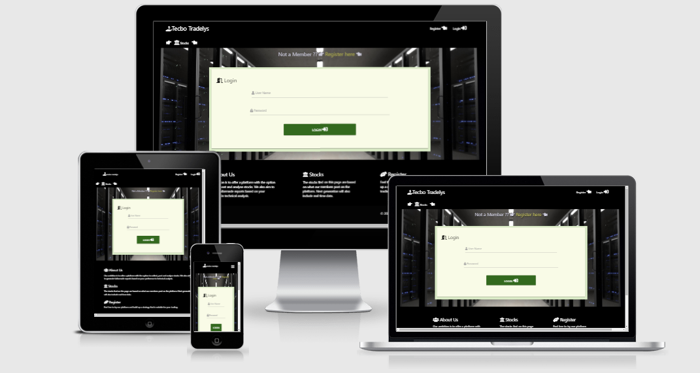

# Tecbo Tradelys

#### The aim of this website is to offer platform where users can add, post and analyse stocks. As a first step users will be able to post their of observations and set strategies to tailor made report for analysing stockmarket data. The longterm goal is to include realtime data and offer the possibility for users to build their of engine for analysing these data. The code for this project is found [here]( https://totebo.herokuapp.com/ "Link to Tecbo Tradelys deployed homepage")

------
-----

## UX(User Experience)

### Project Goal

#### The goal of this project is to build an interactive and responsive website allowing users to store and collect stock market data. Additionally users will be able to store and suggest parameters they want to include in their trading strategy and post this to database used for tailor made analysis for the user. 

#### The features on the website will:
- Give users the possibility to store, add, and analyse stock market data
- Give users a chance to search, update and edit specific stocks
- Give users a to opportunity to reflect over their strategy and post this to database used for generating tailor made report analysing data at the users condition  

#### I will achieve this by:
- By allowing registered user to add and store data in a database
- By allowing registered user to edit, search and update a database with stockinformation
- By allowing user to choose between common parameters within in technical trading and give the user a chance to set up their own strategy and post it to a database used for tailor making report connected to the users strategy

## User Goal

#### I expect this website to be used by the following personas
- People who are interested in the stock market and want to have possibility of creating their own strategy to analysing stock market data. Their age span is supposed to be between 25 and 65 years old.

### User Stories

#### As a person interested in the stockmarket I want to have a website where 

1.	I can find, store and analyse data connected to the stock market (see our stock pages [here]( https://totebo.herokuapp.com/get_stockinfo  "Example from stocks page"))
2.	I can create a strategy to analyse stock related data (see our stock pages [here]( http://totebo.herokuapp.com/profile/  "Example from profilepage"))
3.	I can get informed about the situation for a certain stock based on my tailor made strategy (see our stock pages [here]( http://totebo.herokuapp.com/toolbox "Example from profilepage"))

#### As a person who is involved in the stock market I want to have a website where I can find, post and get informed about and update stock information so that....
1.	I can analyse and search for stocks in my interest
2.	I can store data and follow data under set time period to draw conclusion about which stocks to invest in
3.	I can set up a strategy to draw conclusion whether to buy or sell a stock
4.	I can set up a strategy for my long-term trading philosophy
5.	I can get informed when stocks fall within my trading strategy

-----

### Design Choices

#### Typology

#### Fonts 
I used following font for my project 
- I used standards fonts and fonts connected [materializecss templates]( https://materializecss.com/ “materializecss”) to have predictive behavior of my font over several webbrowsers

#### Colors

- I focused mainly on black,white, gray colortheme to create a clear, simple and easy to read webpage,  the aim is that backgroundimage should draw attention and signal a strong messages that this site is focusing on trade and data extraction

#### Wireframe
[Wireframe](static/documentation/totebo.pdf "Wireframe Tecbo")

## Technologies Used

### Languages

- HTML5
  - Used as the main mark-up language for the website content.
- CSS3
  - Used to style the individual webpages.
- Python
  - Used for setting up environment and conditions for running the application
- Javascript
  -  Used for collecting connecting activate functions within
materializecss components such as dropdown-picker and datepicker for calender function 

### Libraries

- [Materializecss]( https://materializecss.com/ “materializecss”)
  - Used to design a mobile-first responsive website layout.
- jQuery
  - Loaded as part of the Bootstrap CDN starter template
- CDN
  - Loaded as part of the Bootstrap CDN starter template
-Flask 
  - Used as common framework for extracting function, libraries and setting up operative system and constructing templates used in the web pages
-Pymongo
  - Used for setting up connection with MongoDatabase and running CRUD-funtion towards the database
- Dnspython
    -Used for running command towards the database
- Gitignore
  - Used to format code while constructing the webpage and storing sensitive information

### Tools
- Git
  - Git was used for version control by utilising the Gitpod terminal to commit to Git and push to GitHub.
- GitHub
  - Used to store and host the project files after being pushed from Git.
- Gitpod
  - An online IDE linked to the GitHub repository used for the majority of the code development.
- [MongoDB Atlas]( https://www.mongodb.com/cloud/atlas)
  - Used as a database for storing, reading, extracting and editing data
-[Heroku]( https://www.heroku.com/)
 - Used as a server for connecting MongoDB with Github and sourcing web pages
- Font-Awesome
  - Used for icons to enhance headings and add emphasis to text.
- Microsoft PowerPoint
  - Used for creating mockups for e.g., Topology in readme-file
- Am I Responsive?
  - A tool for taking a quick snapshot of the responsive breakpoints of the website to visualise how the site will look on different device screen sizes in one place. The resulting screenshot is also used as the README.md logo image.
- Google Inspection Tool
  - Used for testing the design and its responsiveness
- LightHouse
  - Used for validating how well adjusted the design is in large devices as in small mobile devices
- W3Cs CCS-validator
  - Used for validating the css-code
- W3C Markup-validator
  - Used for validating the html-code
-  [codebeautify](https://codebeautify.org/)
   - Used for formatting/beatify Html and python-code
-  [prettifycss](https://www.prettifycss.com )
   - Used for formatting/beatify css-code
-  [prettifyjs]( https://www.prettifyjs.net/)
   - Used for formatting/beatify javscript-code
- JsHint.com
    - Used for validating javascript code
---

## Features

### Features Implemented

- Responsive mobile first design using Materializecss as a framework.
- User friendly with balanced use of image addressing the core message with the web pages 
- A Navbar with easy navigation that collapses on mobile displays
- Footer with an about section, a fact section about stocks and why to register  
- A open part of the site where non-user can find information about stock stored in the database to draw attention to the webpages
- A Register function and a Login page which allow user to enter the member page
- A member section of the web pages which allow user for setting up trading strategies, extracting, read, editing and storing data connected to strategies and specific stocks

### Future Features

- Include a sequential database for allowing for more advanced mathematical handling of data connected to the stockmarket’
- Extract and connect real time data to the platform allowing the user to get a more realistic way of analysing companies and applying their strategy to “real” inputs 

---

## Version Control

### Version control for this repository is managed within GitHub and Gitpod using main as main branch for the project

- To start with a New Respository was created in GitHub, named [Totebo Trading](https://github.com/GurraT/Totebo-Trading.git)
- Totebo Trading was than linked to Gitpod pressing the green button Gitpod in the newly created Respository
- Gitpod was then used as an editor for creating the code in this project

### Setting up MongoDB Atlas was done in agreement with following step

-	A Cluster called Cluster0 was set up login in to [MongoDB Atlas]( https://account.mongodb.com/) pressing “Create New Cluster”
-	New Database was created pressing “Collection” and then pressing “Create Database”
-	Within “Create Database” a database named totebo was chosen as “Database name” and a collection named users chosen in “Collection name”
-	After creating the database totebo, two more collections were created within in the database via highlighting totebo and pressing “Create Collection”, the two new collection were named categories and stockinfo

### Connecting MongoDB Atlas to GitHub repository was done in agreement with following step
-	To start with the GitHub repository was open via Gitpod editor
-	Within gitpod an operating system was set up by first installing Flask, through printing following code within the editor “pip3 install Flask” and then ”import os”
-	After installation of flask, an app.py and env.py was created in the base directory of the respository
-	Within the env.py file the base environment for the app was set up as follow
_____________________________
    import os
    os.environ.setdefault("IP", "0.0.0.0")
    os.environ.setdefault("PORT", "5000")
    os.environ.setdefault("SECRET_KEY", “<password>”>
    os.environ.setdefault("MONGO_URI", "mongodb+srv://root:<mongopassword>@cluster0.k22xz.mongodb.net/totebo?retryWrites=true&w=majority")
    os.environ.setdefault("MONGO_DBNAME", "totebo")
    __________________________

*the SECRETE_KEY was chosen randomly and was later used to connect the respository to Heroku app, MONG_URI was selected by navigated to MongoDB Atlas Collection, pressing connect and selecting "connect your application" and copy the adress within the adress field and paste it to the os environment for MONGO_URI change the password and collections adress. The password for the MONGO_URI adress was retreived from "Database Acess" within MongoDB selecting edit.

- To connect the code within the env.py file with app.py file following code was inserted to the app.py file
_______________
    import os
    from flask import Flask

    if os.path.exists("env.py"):
    import env

    if __name__ == "__main__":
    app.run(os.environ.get("IP"), port=int(os.environ.get("PORT")), debug=True)
________________________________

- To avoid that sensitive informations was revealed the env.py was then stored in the gitignore file
- To be able to use python code code to communicate with the MongoDB pymongo package was needed to installed, this was done writing "pip3 install flask-pymongo" in the gitpod terminal 
- Additionally following code was inserted to the app.py file
_______
    from flask_pymongo import PyMongo
    mongo = PyMongo(app)
___________________
### To be able to push and connected the GitHub repository to Heroku following step was conducted
- A requirement.txt file for running app.py was set up, writing following statement in the gitpod terminal "pip3 freeze --local > requirements.txt"
- After setting up the requirement file a Procfile was constructing telling Heroku that app.py was used as the main file for running the website, this was done via running following command in the gitpod terminal "echo web: python app.py > Procfile"
### To be able to connect the MongoDB Atlas to Heroku following step was conducted
- In the Heroku under "Setting" the same information as in the env.py was set up
_____________________________
    os.environ.setdefault("IP", "0.0.0.0")
    os.environ.setdefault("PORT", "5000")
    os.environ.setdefault("SECRET_KEY", “<password>”>
    os.environ.setdefault("MONGO_URI", "mongodb+srv://root:<mongopassword>@cluster0.k22xz.mongodb.net/totebo?retryWrites=true&w=majority")
    os.environ.setdefault("MONGO_DBNAME", "totebo")
    ___________________________________

#### Deploying code through Heroku was conducted through by
- First pushing code to github, wrtiting "git add -A", "git commit -m "messages" ", "git push" in the gitpod terminal
- To connected the Github repository to Heroku, the deploy menu of the totebo app in Heroku was selected
- Within the deployment menu the icon "connect to GitHUb" was selected followed by selecting the repository "totebo trading" and than chosing "main bransch" and select "connect", follow by deploy bransch
- To see if the deployment work the icon "view" was pressed

## Testing

- I conducted manual testing and used Lighthouse, google inspection tool, W3C validator(Html/CSS), JsHint (javascript)and PEP8 online checker(python) for automated validation see results below

### Manual testing
- [Protocol/Manual testing](assets/Documentation/manualtesting.pdf "Manual Testing")

### Automated testing of index page
- [W3C Html validation](static/documentation/html_validation_basetemplate.png "Html Testing of index page")
- [Result from lighthouse for large device](static/documentation/lighthouse_ld_basetemplate.png "Test index page on computer through Lighthouse")
- [Result from lighthouse for mobile device](static/documentation/lighthouse_mob_basetemplate.png "Test index page on mobile devices through Lighthouse")

### Automated testing of login page
- [W3C Html validation](static/documentation/html_validation_login.png "Html Testing of login page")
- [Result from lighthouse for large device](static/documentation/lighthouse_ld_login.png "Test login page on computer through Lighthouse")
- [Result from lighthouse for mobile device](static/documentation/lighthouse_mob_login.png "Test login page on mobile devices through Lighthouse")

### Automated testing of register page
- [W3C Html validation](static/documentation/html_validation_register.png "Html Testing of register page")
- [Result from lighthouse for large device](static/documentation/lighthouse_ld_register.png "Test register page on computer through Lighthouse")
- [Result from lighthouse for mobile device](static/documentation/lighthouse_mob_register.png "Test register page on mobile devices through Lighthouse")

### Automated testing of profile page
- [W3C Html validation](static/documentation/html_validation_profile.png "Html Testing of profile page")
- [Result from lighthouse for large device](static/documentation/lighthouse_ld_profile.png "Test profile page on computer through Lighthouse")
- [Result from lighthouse for mobile device](static/documentation/lighthouse_mob_profile.png "Test profile page on mobile devices through Lighthouse")

### Automated testing of message page
- [W3C Html validation](static/documentation/html_validation_toolbox.png "Html Testing of message page")
- [Result from lighthouse for large device](static/documentation/lighthouse_ld_message.png "Test message page on computer through Lighthouse")
- [Result from lighthouse for mobile device](static/documentation/lighthouse_mob_message.png "Test message page on mobile devices through Lighthouse")

### Automated testing of stockmarket page
- [W3C Html validation](static/documentation/html_validation_stockmarket.png "Html Testing of stockmarket page")
- [Result from lighthouse for large device](static/documentation/lighthouse_ld_stockmarket.png "Test stockmarket page on computer through Lighthouse")
- [Result from lighthouse for mobile device](static/documentation/lighthouse_mob_stockmarket.png "Test stockmarket page on mobile devices through Lighthouse")

### Automated testing of add_info page
- [W3C Html validation](static/documentation/html_validation_editstock.png "Html Testing of add_info page")
- [Result from lighthouse for large device](static/documentation/lighthouse_ld_add_info.png "Test add_info page on computer through Lighthouse")
- [Result from lighthouse for mobile device](static/documentation/lighthouse_mob_add_info.png "Test stockmarket page on mobile devices through Lighthouse")

-----------
## Credits

### Image

#### Stocks page
- [Background image](static/img/pexels-pixabay-210600.jpg) was downloaded from [Pexel.com](https://www.pexels.com/photo/antique-bills-business-cash-210600/)

#### Login / register / edit_stock page
- [Background image](static/img/pexels-manuel-geissinger-325229.jpg) was downloaded from [Pexel.com]( https://www.pexels.com/photo/interior-of-office-building-325229)

#### Profile / edit preferences / toolbox page
- [Background image](static/img/pexels-skylar-kang-6368847.jpg) was downloaded from [Pexel.com](https://www.pexels.com/photo/calculator-and-pens-on-wooden-desk-6368847/)

#### Add stocks page
- [Background image](static/img/pexels-pixabay-47344.jpg) was downloaded from [Pexel.com]( https://www.pexels.com/photo/1-us-bank-note-47344/)

### Deployment

The website was developed using Gitpod for constructing code which then was pushed to GitHub which hosted my repository and then cloned and deployed in Heroku. I conducted following step to deploy my code.

- Created a repository in GitHub called [Totebo Trading](https://github.com/GurraT/Totebo-Trading.git)
- Open the repository in Gitpod
- Downloaded the prerequisites such as Flask, os, pymongo and (dnspython)through the gitpod terminal
- created a python-file for my code environment called env.py and a python file which was used for activating my homepage called app.py
- within the env.py I sat up my code environment and the variables connecting to the MongoDB Atlas (see earlier section version control)
- The env.py was than linked to my app.py file importing the environment
- env.py was stored in gitiggnore
- Same variables as in env.py was set up under my setting in my newly made app called totebo in  Heroku
- Before connecting and pushing my GitHub repository to Heroku I constructed a requirement.txt file using the command “pip3 freeze – local > requirement.txt” in the gitpod terminal
- Additionally I created a Procfile using the command “echo web: python app.py > Procfile” in the gitpod terminal
- After setting up the prerequisite I pushed my code to GitHub and then navigated to deployment pages for my app totebo in Heroku
- At the deployment site in Heroku I connected to Github, selected my repository and then selected main branch and press deploy bransch

•	Port 5000, IP 0.0.0.0 and main branch was used for my deployment

### Inspiration

#### For my interactive part and dealing with the datahandling I got inspiration from course material at [Code institute](https://learn.codeinstitute.net/) and mainly the section Backend Development -miniproject for finding inspiration and knowledge about trading I looked at [Avanza]( https://www.avanza.se/start)

### Acknowledgements

- I am grateful for the feedback and constructive comments I got from my mentor Aaron Sinnott at Code Institute e.g. through helping me setting up a realistic schedule and give me inputs on my design and the functions within my application 
#### I also want to thanks following people

- Philip Magnusson, Carl-Johan Svenlin, Tobias Thomsson, Fredrik Thomsson for beta-testing my webpage and given me constructive feedback on the layout and function
- The support I got through slack community from tutors and fellow students, I specially want to thank Igor, Tim, Alan and Sheryl tutor me in times of need 

